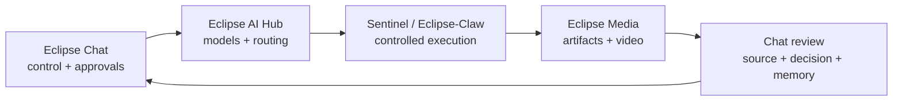

# Operational Agent Stack: от сигнала до результата

> Проверка от 02.08.2026. Цель этого набора не установить шесть случайных инструментов,
> а собрать управляемый pipeline: анализ -> решение -> выполнение -> артефакт -> review.

## Короткий вывод

| Priority | Находка | Решение |
|---|---|---|
| P0 | HyperFrames | Внедрять сейчас в Eclipse Media как local release-video pipeline |
| P1 | Claude Ads | Внедрять read-only audit; любые write-actions только через отдельный approval gate |
| P2 | Open-Generative-AI | Брать идею Model Registry, не форкать runtime вслепую |
| P2 | Camofox Browser | Optional isolated browser worker, а не default scraper |
| P3 | Fincept Terminal | UX/data reference после проверки лицензии и источников |
| P3 | Vibe Trading | Research и paper trading; live execution выключен |

## Общая архитектура Eclipse Forge



Правило: Chat остаётся control plane. Provider keys, browser profiles, broker credentials и
render workers не переносятся в Chat и не разделяются между проектами. Каждый сервис получает
отдельную identity, минимальные scopes, budget и audit без raw secrets/content.

## P0: HyperFrames

**Что это.** Open-source framework HeyGen под Apache-2.0. Композиция пишется как HTML/CSS,
анимации регистрируются в paused GSAP timeline, CLI выполняет preview, lint, validate и MP4 render.

**Куда внедряем.**

- Eclipse Media: release video workspace и deterministic render.
- Eclipse Forge Landing: короткие product trailers и feature announcements.
- Eclipse Chat: PR/roadmap -> draft video -> approval -> publish.
- Shotforge: motion handoff после подготовки кадров и copy.

**Первый срез.** В Eclipse Media хранится готовая Eclipse-композиция. Web UI открывает preview,
показывает текущий статус и копирует offline contract check. MP4 пока не считается доступным:
exact `@hyperframes/cli@0.7.88` нужно проверить, добавить в lockfile и только затем запускать render.

**Acceptance criteria.**

- Offline check подтверждает пять сцен, 15 секунд, GSAP SRI и отсутствие скрытого `npx`.
- Node.js 22+ и FFmpeg проверяются до render.
- HyperFrames CLI вызывается только из локальной exact dependency `0.7.88` и fail closed при её отсутствии.
- Package integrity/lockfile, `lint` и `validate` обязательны перед первым `render`.
- Apache-2.0 HyperFrames не распространяется на GSAP: у него отдельная GreenSock no-charge license,
  copyright notice сохраняется, redistribution template/SDK проверяется отдельно.
- Preview и final MP4 проверяет человек.
- Никаких production secrets, private screenshots или клиентских файлов в template.

## P1: Claude Ads

**Что это.** Community repository AgriciDaniel, а не официальный продукт Anthropic. Даёт
Claude/Codex набор `/ads` workflows: audit, Google/Meta analysis, budget, creative, plan и competitor.

**Куда внедряем.**

- AdService: evidence-based campaign audit и recommendation report.
- Eclipse AI Hub: marketing analyst mode с source/evidence contract.
- Eclipse Chat: approval room, где recommendation превращается в подтверждённое action item.

**Безопасный контракт v1.**

1. Read-only export или sanitized fixture.
2. Finding содержит account/campaign scope, evidence, confidence и expected impact.
3. Recommendation не меняет бюджет и не вызывает Ads API.
4. Owner видит before/after diff и явно подтверждает действие.
5. Write adapter получает отдельный credential, hard ceiling, idempotency key и rollback plan.

Прямой remote installer через pipe не используется. Для Codex upstream предлагает local clone и
`bash install.sh --target=codex --source=local`; перед установкой всё равно нужен static review.

## P2: Eclipse Model Registry

**Reference:** Open-Generative-AI.

Полезна не цифра «500+ моделей», а единый каталог возможностей. Значительная часть upstream
работает через MuAPI и `x-api-key`; локальный execution доступен только для части sd.cpp моделей.
Поэтому Eclipse Forge строит собственный registry contract:

| Field | Зачем |
|---|---|
| `provider` / `modelId` | Не маскировать реальный upstream |
| `capabilities` | image, video, audio, code, embeddings |
| `runtime` | local, self-hosted, cloud |
| `priceSource` / `checkedAt` | Не обещать вечный free tier |
| `privacyBoundary` | Какие данные покидают устройство |
| `hardware` | RAM, VRAM, disk, platform |
| `fallbacks` | Управляемая деградация без скрытой отправки данных |
| `risk` / `license` | Legal и security решение до подключения |

Сторонний remote endpoint, URL импорта и provider response считаются недоверенными. Нужны
allowlist, SSRF-safe network layer, server-side keys, size/time limits и redacted audit.

## P2: Camofox Browser

**Что это.** MIT REST wrapper поверх Camoufox: sessions, pages, accessibility snapshots и browser
automation. Он полезен для страниц, которые нельзя прочитать обычным HTTP renderer.

**Куда внедряем.** Только отдельный optional worker Eclipse-Claw / Sentinel.

**Обязательные guardrails.**

- `CAMOFOX_BIND_HOST=127.0.0.1`, `CAMOFOX_ACCESS_KEY` и private service network для внешнего доступа.
- `CAMOFOX_CRASH_REPORT_ENABLED=false` до privacy review.
- Disposable profile, без primary cookies и password manager.
- Public-only egress, DNS/redirect validation, allowlist и rate limits.
- Web text остаётся untrusted data и не может само вызвать tools.
- Нет anti-detect сценариев для обхода CAPTCHA, банов, paywall или чужих ограничений.
- Automatic HTTP -> browser fallback выключен до отдельного explicit opt-in.

## P3: Financial Research Room

**Reference:** Fincept Terminal.

Берём информационную архитектуру, а не кодовую зависимость: watchlist, source cards, scenario matrix,
assumptions, timeline, citations и decision journal. Community source использует AGPL-3.0, а upstream
требует отдельную платную Commercial License для любого business или internal company use.

**Куда внедряем.** Eclipse Chat Research Room + Eclipse AI Hub analyst, с read-only витринами для
CryptoPulse и FinFlow.

Каждый вывод маркируется как research, показывает источник/дату и не является финансовым советом.
Market data может быть delayed, incomplete или licensed только для display.

## P3: Strategy Lab

**Reference:** HKUDS Vibe Trading.

Полезные паттерны: natural-language hypothesis, несколько исследовательских ролей, debate,
backtesting и compare runs. Upstream broker execution прямо обозначен как experimental, поэтому
наш первый контур заканчивается paper result.

```text
hypothesis -> dataset snapshot -> strategy spec -> backtest -> costs/slippage -> review
```

До live execution нужны отдельные legal review, broker sandbox, max-loss/rate limits, two-person
approval, immutable order audit, kill switch и reconciliation. Пока этого нет, live credentials
не подключаются.

## Как пользоваться первым внедрением

1. Открыть Eclipse Media и выбрать `Видео-студия`.
2. Нажать `Открыть предпросмотр` и проверить композицию в браузере.
3. В каталоге `frontend/public/studio/eclipse-release` выполнить `npm run check`.
4. После восстановления npm registry проверить integrity `@hyperframes/cli@0.7.88`, добавить exact
   devDependency и lockfile, затем выполнить `npm run verify`.
5. Только после зелёного verify выполнить `npm run render`, посмотреть MP4 и передать его в Chat на review.

## Что не делаем

- Не включаем Ads write-actions по одному prompt.
- Не выдаём Fincept/Vibe Trading outputs за финансовый совет.
- Не подключаем live broker account в R&D.
- Не используем anti-detect для обхода чужих защит.
- Не называем cloud models «локальными» и «бесплатными» без provider-level проверки.
- Не публикуем видео автоматически без human preview.

## Источники

- [Claude Ads](https://github.com/AgriciDaniel/claude-ads)
- [Fincept Terminal](https://github.com/Fincept-Corporation/FinceptTerminal)
- [Vibe Trading](https://github.com/HKUDS/Vibe-Trading)
- [Camofox Browser](https://github.com/jo-inc/camofox-browser)
- [HyperFrames](https://github.com/heygen-com/hyperframes)
- [Open-Generative-AI](https://github.com/Anil-matcha/Open-Generative-AI)
- [Browser-agent security study](https://arxiv.org/abs/2505.13076)
