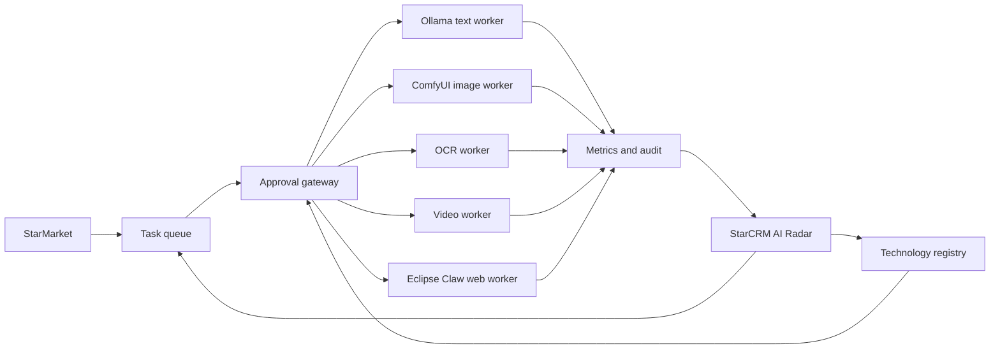

# Star Technology Registry: реестр решений для StarMarket, StarCRM и StarAI

> Практический контракт между Eclipse Library, админкой StarCRM и сервисами StarAI. Реестр отвечает на вопрос «что разрешено внедрять и почему», но не подменяет runtime-мониторинг.

## 1. Что уже опубликовано

Машиночитаемый snapshot: [`web/star-technology-registry.json`](../web/star-technology-registry.json).

Рабочий интерфейс: [`web/registry.html`](../web/registry.html).

Валидатор: [`scripts/validate-star-technology-registry.mjs`](../scripts/validate-star-technology-registry.mjs).

Каждое решение содержит:

- продукт и функцию;
- приоритет `P0`, `P1` или `P2`;
- стадию допуска;
- место выполнения и целевой сервис;
- владельца;
- класс подтверждения;
- benchmark и последнюю дату проверки;
- риски, fallback и следующий шаг;
- ссылку на проверенную карточку каталога или внутренний контракт.

## 2. Граница ответственности

Реестр и runtime health: разные данные.

| Данные | Источник | Что показывать при ошибке |
|---|---|---|
| Решение, риск, лицензия, lifecycle | Eclipse Library | Последний проверенный snapshot и его дату |
| Доступность модели и worker | StarAI health API | «Нет связи», а не `0` |
| Очередь, latency, VRAM, ошибки | StarAI metrics | Последнее измерение и признак устаревания |
| Пилоты и одобрения | StarCRM database | Ошибку запроса и повтор, без optimistic success |
| Выполненные действия | StarCRM audit log | Неизменяемую историю, даже если агент недоступен |

Нельзя вычислять `production` по одному успешному health check. `Production` означает, что artifact, prompt contract, benchmark и fallback одобрены. Health показывает, доступен ли этот release сейчас.

## 3. Lifecycle

1. `candidate`: источник найден, но benchmark не завершён.
2. `reviewed`: источник, лицензия и основные риски проверены.
3. `pilot`: ограниченный тест без скрытой автопубликации.
4. `approved`: можно подключать по закреплённому контракту и runbook.
5. `production`: рабочий сценарий и benchmark подтверждены.
6. `reference`: используем идеи, но не подключаем сервис к рабочим данным.
7. `blocked`: прямое использование запрещено до снятия риска.

Переход стадии является административным действием. Агент может подготовить предложение, benchmark и diff, но не может сам одобрить собственную технологию.

## 4. StarMarket

### Импорт WB, Ozon и Яндекс Маркета

Основной путь: API или обычный HTML parser. Screenshot parsing включается только как fallback по контракту из [marketplace-screenshot-parsing.md](marketplace-screenshot-parsing.md).

Обязательные правила:

- сохранять source URL, время и тип extraction;
- возвращать confidence по каждому важному полю;
- повторно сверять SKU/артикул и цену;
- не придумывать отсутствующие значения;
- отправлять конфликт в ручную очередь.

### Аудит карточки

Детерминированный rule engine проверяет обязательные поля, типы, цену, категорию и policy. Локальная LLM добавляет объяснение, SEO-рекомендации и семантические признаки, но не отменяет правила.

Benchmark должен считать precision/recall по каждому правилу и отдельно false positives. Итог аудита хранит version правил и model/prompt release.

### Изображения

ComfyUI работает за StarAI worker. В приложение нельзя отдавать прямой ComfyUI API.

Закрепляются:

- core version;
- workflow JSON;
- model и LoRA checksum;
- allowlist custom nodes;
- input/output schema;
- timeout и max attempts.

Публикация результата требует подтверждения пользователя. Ошибка генерации не должна заменять исходное изображение.

### Видео

VideoMAE используется только как первый feature-extraction слой по [starmarket-video-moderation.md](starmarket-video-moderation.md). Для каждого класса нужно 200-500 размеченных примеров. Затем идут покадровый NSFW, OCR, ASR и правила маркетплейса.

HyperFrames подходит для повторяемых шаблонных роликов. Текст, safe zones, длительность и assets валидируются до render.

## 5. StarCRM: AI Radar

Первый read-only контракт:

```http
GET /admin/system/technology-registry
GET /admin/system/ai/runtime-health
GET /admin/system/technology-registry/{entryId}/benchmarks
```

Предлагаемый ответ реестра:

```json
{
  "snapshot_at": "2026-08-03T00:00:00Z",
  "source": "eclipse-library",
  "entry": {
    "id": "starai-ollama-text-runtime",
    "product_id": "star-ai",
    "lifecycle": "production",
    "priority": "P0",
    "approval": "read-only",
    "benchmark": { "status": "passed" }
  },
  "runtime": {
    "status": "healthy",
    "checked_at": "2026-08-03T12:00:00Z",
    "stale": false
  }
}
```

Создание пилота: отдельная подтверждаемая команда:

```http
POST /admin/system/technology-registry/{entryId}/pilots
Idempotency-Key: <uuid>
```

До подтверждения endpoint возвращает план: изменения, permissions, бюджет, fixtures, критерии успеха, rollback и владельца. Реальный запуск вызывается второй командой после server-side authorization. Любой timeout означает deny.

## 6. Комната агентов

Сессия строится по раундам:

1. **Диагностика.** Операционный агент формулирует наблюдаемые симптомы.
2. **Возражения.** Security, product и data роли ищут слабые места.
3. **Проверка фактов.** Инструменты выполняют только разрешённые read-only запросы; каждое утверждение получает evidence.
4. **Консенсус.** Coordinator перечисляет согласованные и нерешённые пункты.
5. **Предлагаемые действия.** Для каждого шага указываются action class, риск, ожидаемый результат и rollback.

Одна модель с разными system prompts не гарантирует независимое мнение. Интерфейс обязан показывать фактические источники, используемые инструменты, provider/model, latency и разногласия, которые не удалось снять.

Изменения кода, публикации и настройки остаются запросами на подтверждение администратора. Агент не подтверждает собственный план.

### Agent Office: наблюдение без иллюзии контроля

Главный экран сессии строится из трёх рабочих зон:

1. **Команда.** Coordinator и участники с ролью, provider/model, текущим статусом, назначенной задачей и остатком бюджета.
2. **Живая сессия.** Сообщения администратора и агентов, tool calls, evidence, предложения действий, approvals и результат. Лента возобновляется по SSE cursor после разрыва соединения.
3. **Карта работы.** Кликабельные узлы агентов и задач со связями `назначил`, `проверяет`, `возражает`, `ждёт подтверждения`, `создал artifact`.

Карта не является украшением. Клик по агенту фильтрует ленту и задачи; клик по задаче показывает входные данные, владельца, этап, лимиты, evidence и ожидаемый результат. Цвет никогда не является единственным носителем статуса.

Допустимые статусы агента: `idle`, `planning`, `working`, `using_tool`, `waiting_agent`, `waiting_approval`, `blocked`, `failed`, `done`, `paused`. Для каждого статуса интерфейс показывает человеческую подпись и время последнего события.

В ленте нельзя показывать или сохранять raw chain-of-thought. Вместо него публикуются:

- краткое обоснование решения;
- проверяемые факты и ссылки на evidence;
- вызванный инструмент и безопасное резюме результата;
- обнаруженные разногласия;
- предложенное действие, риск и rollback.

Основные команды администратора: `Поставить задачу`, `Добавить ограничение`, `Сменить приоритет`, `Пауза`, `Возобновить`, `Добавить роль`, `Отклонить действие`, `Подтвердить действие`. Управляющие команды создают audit event; mutating и destructive действия не запускаются из самой ленты.

На узком экране три зоны становятся вкладками `Команда`, `Обсуждение`, `Работа`. Текстовая лента и список задач остаются полноценным fallback, если визуальная карта не загрузилась или включён reduced motion.

### Контракт оркестрации

Coordinator создаёт ограниченный граф задач, а не бесконечный автономный цикл. Каждая задача проходит только допустимые переходы:

```text
proposed -> queued -> running -> waiting_approval -> running -> completed
                         |              |                |
                         +-> blocked    +-> rejected     +-> failed
                         +-> paused                       +-> cancelled
```

У задачи обязательны `session_id`, `task_id`, `idempotency_key`, `role_id`, `input_scope`, `tool_allowlist`, `budget`, `deadline`, `expected_result`, `precondition_hash` и `parent_task_id`. События append-only; повторная доставка с тем же idempotency key не запускает действие второй раз.

Шаблон команды хранит versioned-паспорта ролей. Минимальный состав: coordinator, operator, critic, fact-checker и security. Разные system prompts сами по себе не считаются независимым мнением: роли должны иметь разные цели проверки, evidence и доступные read-only инструменты.

### Ячейки, бюджеты и коннекторы

Каждая сессия исполняется в отдельной ячейке StarAI с ограничениями workspace, сети, credentials и ресурсов. Обычная директория не считается sandbox. Для ячейки задаются TTL, egress allowlist, encrypted secret mounts, CPU/RAM/GPU limits и retention evidence.

Бюджет задаётся до старта и включает токены, wall time, GPU seconds, стоимость внешнего fallback и число действий. Достижение hard limit останавливает новые tool calls и возвращает незавершённый результат администратору. Автоматическое увеличение бюджета запрещено.

Вместо внешнего OAuth broker используется собственный tool gateway: signed manifest, закреплённый schema hash, per-tool scopes, SSRF guard, redaction, health-check и emergency revoke. Изменение описания или схемы инструмента после approval переводит его обратно в review.

Approval содержит immutable action digest, diff, ресурсы, риск, ожидаемый результат, preconditions и rollback. Token одноразовый; изменение preconditions или timeout означает deny.

## 7. StarAI

Рекомендуемый контур:



Для RTX 4060 8 GB тяжёлая GPU-очередь начинает с `concurrency=1`. Интерактивные и фоновые задачи разделяются приоритетами, но не исполняются параллельно без подтверждённого VRAM benchmark.

Model Registry хранит единый release record:

```json
{
  "model_id": "qwen2.5:7b",
  "artifact_digest": "sha256:<digest>",
  "runtime": "ollama",
  "runtime_version": "<version>",
  "prompt_contract": "auto-reply-v3",
  "license_review": "approved",
  "benchmark_run": "<immutable-run-id>",
  "fallback": ["next-approved-local-provider"],
  "approved_by": "<admin-id>",
  "approved_at": "<timestamp>"
}
```

## 8. Что берём у Teamly.to

Teamly.to полезен как продуктовый reference: coordinator собирает команду ролей, задачи исполняются в изолированных рабочих пространствах, действия классифицируются, а результат виден в activity stream. Публичные тарифы используют собственные credits и облачную инфраструктуру: [сайт Teamly.to](https://teamly.to/).

Берём:

- coordinator как единую точку постановки задачи;
- готовые шаблоны команд и ролей;
- назначение задач и видимый progress;
- изолированное workspace для каждой сессии;
- action classes, approval gate и audit;
- лимиты бюджета и времени.

Не берём:

- передачу рабочих данных внешней цепочке моделей;
- OAuth broker для production-аккаунтов;
- standing authorization по умолчанию;
- approval по таймауту;
- неявные credits без привязки к реальной стоимости задачи.

Причина: политика конфиденциальности указывает передачу данных нескольким AI-провайдерам и размещение production-инфраструктуры в США: [Privacy Policy](https://teamly.to/privacy), [Subprocessors](https://teamly.to/subprocessors). Условия перекладывают ответственность за действия агентов на пользователя и описывают предварительные разрешения: [Terms of Service](https://teamly.to/terms). Для Star контура эти идеи реализуются локально; Teamly.to не получает production-данные, cookies, OAuth tokens или клиентские материалы.

## 9. Agent Reach

Agent Reach не устанавливается глобально. Решение и High-risk причины уже зафиксированы в [agent-reach-security-review-2026-07-31.md](agent-reach-security-review-2026-07-31.md): browser cookies, mutable third-party CLI, изменение локальной конфигурации и prompt injection.

В production используется Eclipse Claw с SSRF guard, server-side allowlist, ограничениями размера/redirects и недоверенным web-text. Из Agent Reach можно перенести только connector registry, `doctor` и понятный fallback UX.

## 10. План внедрения

### Этап A: реестр

- Подключить JSON snapshot к read-only AI Radar.
- Показывать lifecycle отдельно от runtime health.
- Добавить поиск, продукт, функцию, риск, лицензию и benchmark.
- Не показывать «0», если endpoint недоступен.

### Этап B: пилоты

- Создавать pilot plan с idempotency key.
- Хранить fixtures, budget, owner и критерии успеха.
- Выполнять пилот только после подтверждения.
- Записывать immutable result и решение approve/reject.

### Этап C: агенты

- Постоянные сессии и SSE.
- Роли, provider/model и инструменты на каждом сообщении.
- Evidence и отдельный список нерешённых разногласий.
- Confirm-required actions с audit и результатом.

### Этап D: production

- Регулярный model benchmark.
- GPU queue metrics и cancellation.
- Alert на устаревший snapshot, деградацию качества и fallback в платный provider.
- Rollback на предыдущий одобренный release.

## 11. Проверки перед выпуском

```bash
node scripts/validate-star-technology-registry.mjs
node --check web/registry.js
```

Дополнительно:

- проверить desktop и mobile layout;
- проверить loading, empty, error и keyboard focus;
- убедиться, что все внешние ссылки используют HTTPS;
- убедиться, что в snapshot нет ключей, cookies, prompts, клиентских payload или приватных URL;
- провести dependency и supply-chain review перед установкой любого runtime.
